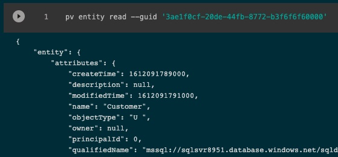

# Azure Purview CLI
This package provides a command line interface to Azure Purview's REST API.  


## Pre-Requisites
1. An [Azure Purview](https://docs.microsoft.com/en-us/azure/purview/create-catalog-portal) account.
2. A [Service Principal](https://docs.microsoft.com/en-us/azure/purview/tutorial-using-rest-apis#create-a-service-principal-application) (Azure AD application). 
3. Grant Service Principal [role assignment](https://docs.microsoft.com/en-us/azure/purview/tutorial-using-rest-apis#configure-your-catalog-to-trust-the-service-principal-application) *(Azure Purview > Access Control (IAM) > Add role assignment > Purview Data Curator)*.

## Installation
```
pip install purviewcli
```

## Configuration
You will need the following to initialise the configuration file:
* Client ID *(aka Application ID)*
* Client Secret
* Tenant ID *(aka Directory ID)*
* Azure Purview Account Name
* Output Path *(e.g. Windows: C:/Users/username/Desktop Mac: /Users/username/Desktop)*

To initiate the configuration, execute the following command.
```
purviewcli config
```


## Usage
```
purviewcli command (mandatory parameters) [optional parameters]
```

## Commands
```
config
search (--keywords=<keywords>) [--limit=<limit> --offset=<offset>]
getEntityAudit (--guid=<guid>) [--auditAction=<auditAction> --count=<count> --startKey=<startKey>]
getEntityBulk (--guid=<guid>...) [--ignoreRelationships --minExtInfo]
getEntityBulkHeaders [--tagUpdateStartTime=<tagUpdateStartTime>]
getEntityBulkUniqueAttributeType (--typeName=<typeName>) [--ignoreRelationships --minExtInfo]
getEntityBusinessmetadataImportTemplate
getEntityGuid (--guid=<guid>) [--ignoreRelationships --minExtInfo]
getEntityGuidClassification (--guid=<guid> --classificationName=<classificationName>)
getEntityGuidClassifications (--guid=<guid>)
getEntityGuidHeader (--guid=<guid>)
getEntityUniqueAttributeType (--typeName=<typeName> --attrKey=<attrKey> --attrVal=<attrVal>) [--ignoreRelationships --minExtInfo]
getEntityUniqueAttributeTypeHeader (--typeName=<typeName> --attrKey=<attrKey> --attrVal=<attrVal>)
getGlossary [--glossaryGuid=<glossaryGuid>] [--limit=<limit> --offset=<offset> --sort=<sort>]
getGlossaryCategories (--glossaryGuid=<glossaryGuid>) [--limit=<limit> --offset=<offset> --sort=<sort>]
getGlossaryCategoriesHeaders (--glossaryGuid=<glossaryGuid>) [--limit=<limit> --offset=<offset> --sort=<sort>]
getGlossaryCategory (--categoryGuid=<categoryGuid>)
getGlossaryCategoryRelated (--categoryGuid=<categoryGuid>) [--limit=<limit> --offset=<offset> --sort=<sort>]
getGlossaryCategoryTerms (--categoryGuid=<categoryGuid>) [--limit=<limit> --offset=<offset> --sort=<sort>]
getGlossaryDetailed (--glossaryGuid=<glossaryGuid>)
getGlossaryTerm (--termGuid=<termGuid>)
getGlossaryTerms (--glossaryGuid=<glossaryGuid>) [--limit=<limit> --offset=<offset> --sort=<sort>]
getGlossaryTermsAssignedEntities (--termGuid=<termGuid>) [--limit=<limit> --offset=<offset> --sort=<sort>]
getGlossaryTermsHeaders (--glossaryGuid=<glossaryGuid>) [--limit=<limit> --offset=<offset> --sort=<sort>]
getGlossaryTermsRelated (--termGuid=<termGuid>) [--limit=<limit> --offset=<offset> --sort=<sort>]
getLineage (--guid=<guid>) [--depth=<depth> --width=<width> --direction=<direction> --forceNewApi --includeParent --getDerivedLineage]
getLineageUniqueAttributeType (--typeName=<typeName>) [--depth=<depth> --direction=<direction>]
getRelationshipGuid (--guid=<guid>) [--extendedInfo]
getTypesBusinessmetadatadef (--guid=<guid> | --name=<name>)
getTypesClassificationdef (--guid=<guid> | --name=<name>)
getTypesEntitydef (--guid=<guid> | --name=<name>)
getTypesEnumdef (--guid=<guid> | --name=<name>)
getTypesRelationshipdef (--guid=<guid> | --name=<name>)
getTypesStructdef (--guid=<guid> | --name=<name>)
getTypesTypedef (--guid=<guid> | --name=<name>)
getTypesTypedefs
getTypesTypedefsHeaders
getDatasources
getDatasource (--datasource=<datasource>)
getScans (--datasource=<datasource>)
getScan (--datasource=<datasource> --scanName=<scanName>)
getScanHistory (--datasource=<datasource> --scanName=<scanName>)
getScanFilters (--datasource=<datasource> --scanName=<scanName>)
runScan (--datasource=<datasource> --scanName=<scanName>) [--scanLevel=<scanLevel>]
getSystemScanRulesets
getSystemScanRulesetsSettings
getScanRulesets
getAssetDistributionByDataSource [--registeredSourceGroup=<registeredSourceGroup> --classificationCategory=<classificationCategory> --classificationName=<classificationName>]
getAssetDistributionByTopPaths (--datasource=<datasource>) [--registeredSourceGroup=<registeredSourceGroup> --classificationCategory=<classificationCategory> --classificationName=<classificationName>]
getFileTypeSizeTimeSeries (--fileType=<fileType> --window=<window>) [--registeredSourceGroup=<registeredSourceGroup> --datasource=<datasource>]
getFileTypeSizeTrendByDataSource (--fileType=<fileType> --window=<window>) [--registeredSourceGroup=<registeredSourceGroup> --datasource=<datasource>]
getTopFileTypesBySize [--registeredSourceGroup=<registeredSourceGroup> --datasource=<datasource>]
getTopLevelSummary [--registeredSourceGroup=<registeredSourceGroup>]
getRegisteredSourceGroupsWithAssets
```

## Export to JSON
```
purviewcli json command (mandatory parameters) [optional parameters]
```

## Export to CSV
```
purviewcli csv command (mandatory parameters) [optional parameters]
```